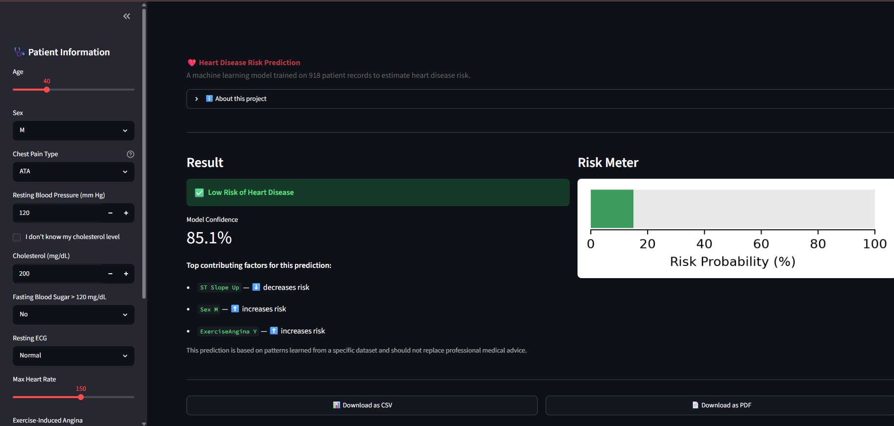
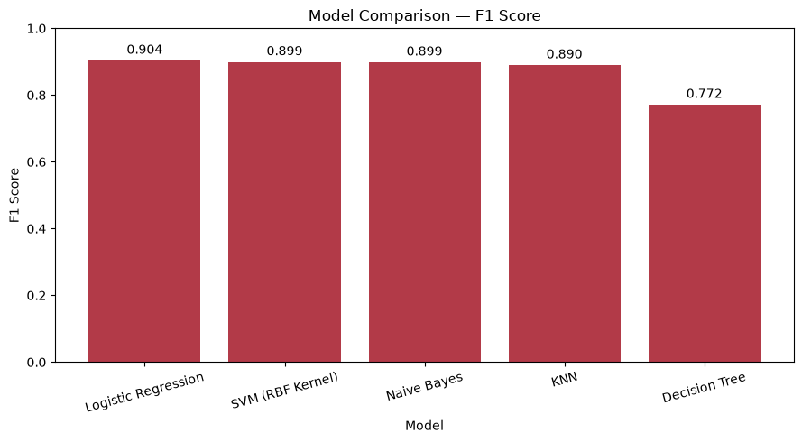
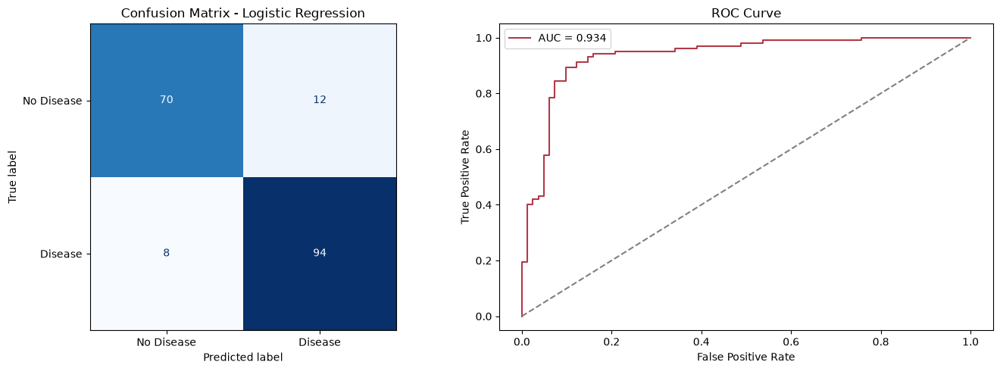

# ❤️ Heart Disease Prediction using Machine Learning

An end-to-end data science project that predicts the risk of heart disease
from clinical patient data, covering exploratory data analysis, statistical
testing, a leakage-free preprocessing pipeline, model comparison, and
deployment as an interactive Streamlit web app.

**⚠️ Disclaimer:** This project is for educational purposes only. It is not
a medical diagnostic tool and should not be used as a substitute for
professional medical advice.

---

## 📸 App Preview



---

## 📋 Project Overview

Heart disease is one of the leading causes of death globally. This project
uses a supervised machine learning classification approach to estimate the
likelihood of heart disease based on 11 clinical features, including age,
sex, chest pain type, resting blood pressure, cholesterol, and more.

The project follows a complete, professional data science workflow:

1. **Exploratory Data Analysis** — univariate and bivariate analysis of all features
2. **Data Quality Investigation** — identifying and correctly handling invalid zero values in `Cholesterol` and `RestingBP`
3. **Statistical Testing** — Chi-square tests for categorical features, point-biserial correlation for numerical features
4. **Leakage-Free Preprocessing** — a `scikit-learn` `Pipeline` with `ColumnTransformer` for imputation, scaling, and encoding
5. **Model Comparison** — five classification algorithms evaluated on a held-out test set
6. **Deployment** — an interactive Streamlit web app with PDF/CSV report downloads

---

## 📊 Dataset

- **Source:** [Heart Failure Prediction Dataset (Kaggle / UCI)](https://www.kaggle.com/datasets/fedesoriano/heart-failure-prediction)
- **Records:** 918 patients
- **Features:** 11 clinical features + 1 target variable (`HeartDisease`)

| Feature | Description |
|---|---|
| Age | Patient age in years |
| Sex | M / F |
| ChestPainType | ASY, ATA, NAP, TA |
| RestingBP | Resting blood pressure (mm Hg) |
| Cholesterol | Serum cholesterol (mg/dL) |
| FastingBS | Fasting blood sugar > 120 mg/dL (1 = yes, 0 = no) |
| RestingECG | Normal, ST, LVH |
| MaxHR | Maximum heart rate achieved |
| ExerciseAngina | Exercise-induced angina (Y/N) |
| Oldpeak | ST depression induced by exercise |
| ST_Slope | Up, Flat, Down |
| **HeartDisease** | Target: 1 = disease, 0 = no disease |

---

## 🔍 Key EDA Findings

- The target classes are moderately balanced (55.3% disease vs 44.7% no disease).
- `Cholesterol` contained 172 records (18.7%) with a value of `0`, and `RestingBP` had 1 — both physiologically impossible and treated as missing data, then median-imputed within the pipeline.
- `ST_Slope`, `ChestPainType`, and `ExerciseAngina` showed the strongest association with heart disease among categorical features (Chi-square, all p < 0.001).
- `Oldpeak` and `MaxHR` showed the strongest linear relationship with the target among numerical features (|r| ≈ 0.40).

---

## 🤖 Model Comparison

Five classification models were trained and evaluated using an identical,
leakage-free preprocessing pipeline:

| Model | Accuracy | F1 Score |
|---|---|---|
| **Logistic Regression** | **0.89** | **0.90** |
| SVM (RBF Kernel) | — | — |
| KNN | — | — |
| Decision Tree | — | — |
| Naive Bayes | — | — |

**Best Model: Logistic Regression**
- Accuracy: 89%
- F1 Score: 0.90
- ROC-AUC: 0.934




---

## ⚙️ Tech Stack

- **Language:** Python
- **Data Analysis:** Pandas, NumPy
- **Visualization:** Matplotlib, Seaborn
- **Machine Learning:** scikit-learn
- **Statistical Testing:** SciPy
- **Deployment:** Streamlit
- **Report Generation:** fpdf2

---

## 📁 Project Structure

```
heart-disease-prediction/
│
├── app/
│   └── app.py                       # Streamlit web application
├── data/
│   └── heart.csv                    # Dataset
├── models/
│   └── heart_disease_pipeline.pkl   # Trained preprocessing + model pipeline
├── notebooks/
│   └── main.ipynb                   # Full EDA, preprocessing, and modeling notebook
├── screenshots/
│   └── app_screenshot.png
├── requirements.txt
├── README.md
├── .gitignore
└── LICENSE
```

---

## 🚀 How to Run Locally

1. **Clone the repository**
```bash
   git clone https://github.com/<your-username>/heart-disease-prediction.git
   cd heart-disease-prediction
```

2. **Install dependencies**
```bash
   pip install -r requirements.txt
```

3. **Run the Streamlit app**
```bash
   streamlit run app/app.py
```

4. **(Optional) Explore the notebook**
```bash
   jupyter notebook notebooks/main.ipynb
```

---

## 🖥️ App Features

- Interactive sidebar for entering patient clinical data
- Real-time risk prediction with confidence score
- Visual risk meter
- Top contributing factors for each prediction (model-based)
- Downloadable prediction report in **CSV** and **PDF** format
- Handles missing cholesterol input gracefully via the trained pipeline

---

## 🔮 Future Improvements

- Hyperparameter tuning (GridSearchCV) for further performance gains
- SHAP-based explainability for more detailed per-prediction insights
- Deployment on Streamlit Community Cloud for public access
- Expanded dataset with additional clinical features

---

## 👤 Author

**Usman Haider**
Data Science Student Project

---

## 📄 License

This project is licensed under the MIT License — see the [LICENSE](LICENSE) file for details.